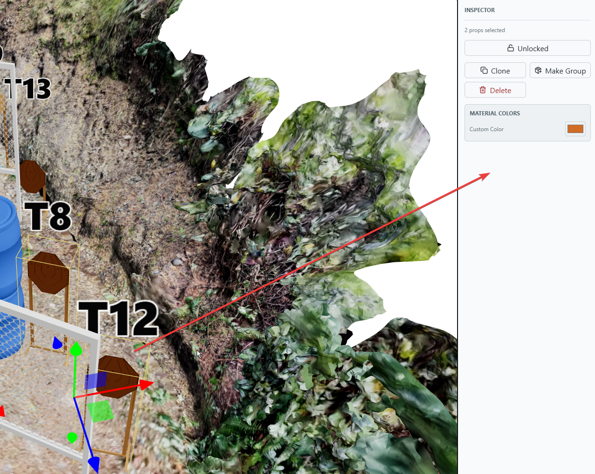
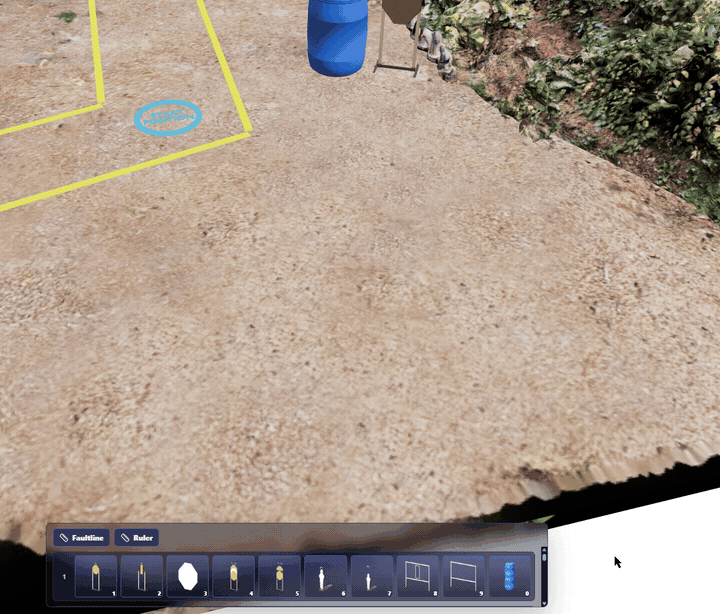
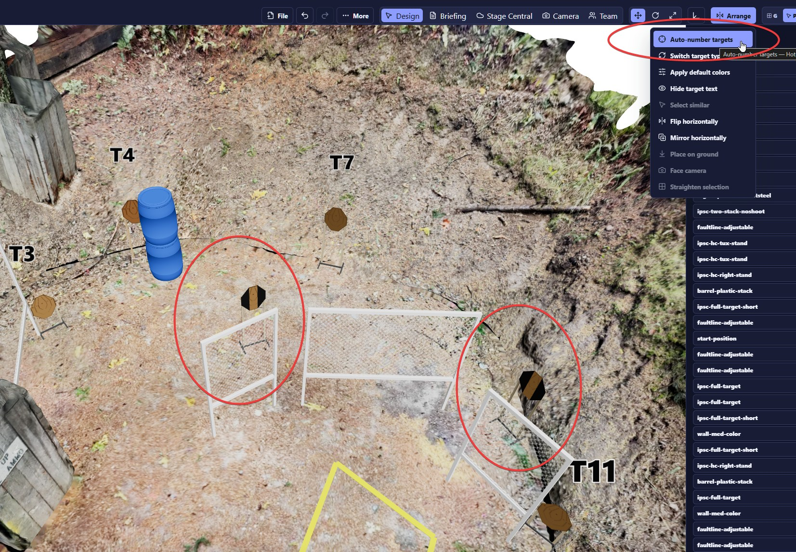
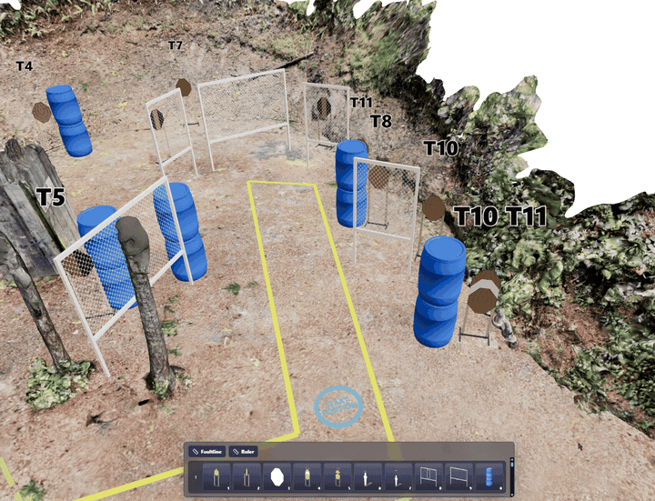
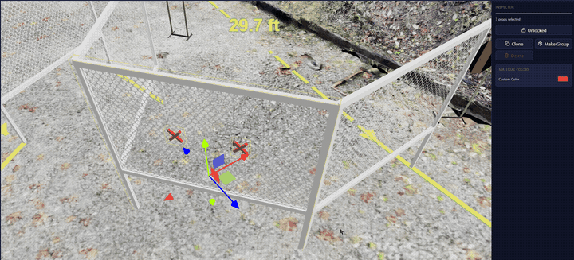
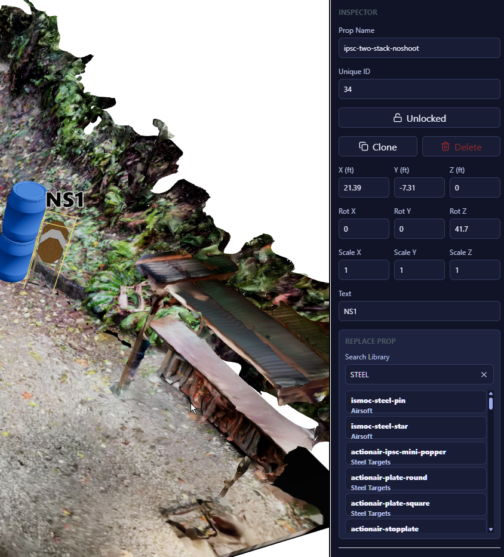
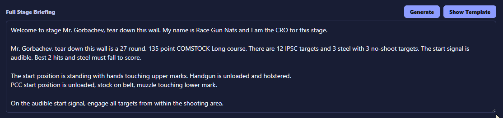
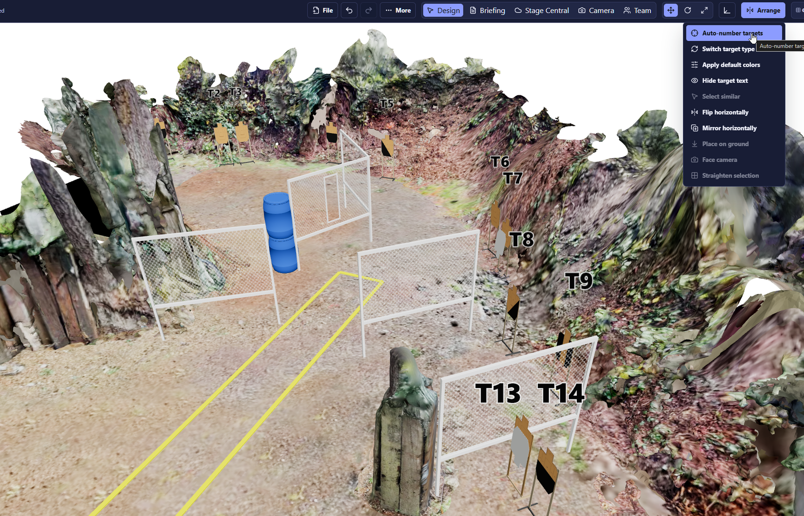

# Practism Designer Web — Feedback Log (Round 2)

**Tester:** Ken Wang
**App version / build:** *(fill in)*
**Browser / OS:** *(e.g. Chrome / Windows 11)*
**Test period:** 2026-08-18 → *(ongoing)*

Round 1 (items 001–010, already shared with the developer) is in [`PRACTISM-DESIGNER-FEEDBACK.md`](./PRACTISM-DESIGNER-FEEDBACK.md).
Media for this round lives in [`feedback-media-r2/`](./feedback-media-r2/), named `RNN-short-slug.png|gif` to match the item ID.

---

## Summary

| ID | Title | Type | Severity | Status |
| --- | --- | --- | --- | --- |
| R01 | Support multi-prop replacement — Replace Prop only works with a single selection | Feature Request | Medium | Open |
| R02 | Wall rotation always pivots about the same end, regardless of where it's dragged | Bug | High | Open |
| R03 | `ipsc-hc-tux-stand` targets lose their number label after "Auto-number targets"; Undo doesn't restore it | Bug | High | Open |
| R04 | The same tux-stand targets get pulled into unrelated multi-selections and move with them | Bug | High | Open |
| R05 | "Make Group" has no effect — grouped props still move individually | Bug | High | Open |
| R06 | Ruler snapped to props should follow those props when they move | Feature Request | Medium | Open |
| R07 | `ipsc-two-stack-noshoot` labeled `NS1` instead of a target number; no-shoot numbering not needed at all | Bug | Medium | Open |
| R08 | Stage briefing template isn't preserved — second "Generate" reverts to the default template | Bug | High | Open |
| R09 | Auto-number targets leaves gaps in the sequence after targets are deleted | Bug | Medium | Open |

**Type:** Bug · UX · Feature Request · Performance · Docs
**Severity:** Blocker · High · Medium · Low
**Status:** Open · Confirmed · Fixed · Won't Fix · Deferred

### Themes

**A. Auto-number targets is unreliable (R03, R04, R07, R09)** — the highest-impact cluster this round. Running it drops labels entirely for `ipsc-hc-tux-stand` (R03), corrupts those targets' selection state so they follow every later selection (R04), leaves permanent gaps in the sequence after deletions (R09), and mislabels combined props like `ipsc-two-stack-noshoot` as no-shoots so their scoring target never gets numbered (R07). Since Auto-number is a routine finishing step, all of this lands on essentially every finished stage — and R03's Undo gap makes it unrecoverable in-session.

**B. Object relationships aren't real (R02, R05, R06)** — grouping doesn't bind props together (R05), wall endpoint rotation has one hard-coded pivot rather than a handle per end (R02), and ruler endpoints snapped to props don't follow those props (R06). Common root theme: relationships that look established in the UI aren't enforced by the model. R06 is the riskiest of the three because a stale measurement still *looks* authoritative.

**C. Bulk editing gaps (R01)** — Replace Prop is single-selection only, so swapping a prop type across a bay is one-at-a-time.

**D. Briefing template persistence (R08)** — the edited template is discarded on the next Generate, and there's no match/team/user scope to share wording across a match book.

### Suggested priority

1. **R04** — silently displaces props for the rest of the session; can corrupt a finished stage without the designer noticing
2. **R03** — data loss with no Undo path
3. **R05** — a headline feature with no functional effect
4. **R09, R07** — numbering correctness; both reach the printed match book
5. **R08** — repeated rework on every briefing regeneration
6. **R02, R06, R01** — workflow friction and stale-measurement risk

### Cross-round notes

R02 is a follow-up to round 1 #009 (wall endpoint rotation shipped, but with a single pivot). R01 supersedes much of round 1 #003/#005. R06 shares round 1 #008's theme that snapped relationships should persist as constraints rather than one-time placement aids.

---

## R01 — Support multi-prop replacement — Replace Prop only works with a single selection

- **Type:** Feature Request
- **Severity:** Medium
- **Status:** Open
- **Area:** Inspector / Replace Prop
- **Date:** 2026-08-18

**Steps to reproduce**
1. Select two or more props in the scene (e.g. two identical target stands).
2. Look at the Inspector panel.

**Expected**
A **Replace Prop** action available for the whole selection, replacing every selected prop with the chosen library item in one operation (preserving each prop's own position and rotation).

**Actual**
With multiple props selected the Inspector only offers Unlocked / Clone / Make Group / Delete and Material Colors — Replace Prop is absent. Replacing several props of the same kind means repeating the single-select replace flow once per prop.

**Why**
Common scenarios: swapping every plain target stand for a different stand model, changing all barrels/walls of one type to another after a layout decision, or correcting a prop choice applied across a whole bay. Doing this one at a time is slow and error-prone.

**Nice-to-haves**
- "Select all props of this type" helper (in the bay or in the whole stage) to build the selection quickly.
- Preserve per-prop transform on replacement; option to keep or reset scale.
- Show the count in the confirm affordance, e.g. "Replace 6 props with …".

**Media**

**Notes**
Screenshot shows the Inspector with "2 props selected" — no Replace Prop option is offered.
Related: round 1 #003 and #005 — the single-select replace flow also clears the search box and needs an extra confirm click. Bulk replace would largely obviate both.

---

## R02 — Wall rotation always pivots about the same end, regardless of where it's dragged

- **Type:** Bug
- **Severity:** High
- **Status:** Open
- **Area:** 3D Canvas / Wall manipulation
- **Date:** 2026-08-18

**Steps to reproduce**
1. Select a wall in the bay.
2. Drag anywhere on the wall to rotate it — including near the end you want to keep fixed.
3. Observe which end stays put.

**Expected**
Two distinct endpoint hotspots: grabbing one end pivots the wall about the *opposite* end. Which end is anchored should be the designer's choice — normally the end already snapped to another prop.

**Actual**
There is only one rotation behavior: the wall always pivots about the same end (the left end in testing), no matter where the drag starts. There aren't two draggable endpoint hotspots — dragging near the "fixed" end still swings the wall about that same end. This appeared with the recent update.

**Why it matters**
The anchored end is dictated by the layout. If a wall is snapped at the end that happens to be the fixed pivot, there's no way to swing the free end without repositioning or re-creating the wall.

**Suggested fix**
- Expose a hotspot at each end; the grabbed end moves and the opposite end acts as the pivot.
- Or at minimum, add a way to toggle/flip which end is the pivot.
- Bonus: auto-select the snapped end as the pivot when one end is attached to another prop.

**Media**

**Notes**
Follow-up to round 1 #009 (endpoint-drag rotation for walls) — endpoint rotation landed, but with a single hard-coded pivot rather than a handle at each end.

---

## R03 — `ipsc-hc-tux-stand` targets lose their number label after "Auto-number targets"; Undo doesn't restore it

- **Type:** Bug
- **Severity:** High
- **Status:** Open
- **Area:** Arrange / Auto-number targets · Undo
- **Date:** 2026-08-18

**Steps to reproduce**
1. Build a stage containing `ipsc-hc-tux-stand` targets alongside regular targets.
2. Run **Arrange → Auto-number targets**.
3. Look at the `ipsc-hc-tux-stand` targets.
4. Press Undo.

**Expected**
Auto-number assigns a number to every scoring target, including `ipsc-hc-tux-stand`, and each keeps its visible `TN` label. Undo fully reverts the operation.

**Actual**
After Auto-number, the `ipsc-hc-tux-stand` targets have **no number label displayed at all** (circled in red in the screenshot) while the other targets show T3/T4/T7/T11 normally. **Undo does not bring the labels back**, so the state is unrecoverable without rebuilding those targets.

**Why it matters**
Unnumbered targets can't be referenced in the stage briefing or by the RO, and the loss is permanent within the session since Undo doesn't restore it. Auto-number is a routine finishing step, so this can silently damage a finished stage.

**Suggested fix**
- Include `ipsc-hc-tux-stand` (and any other stand/hardcover target variants) in the auto-number target-type list, or at minimum leave their existing labels untouched rather than clearing them.
- Make Auto-number a single undoable transaction that restores every affected target's prior number and label visibility.

**Media**

**Notes**
Screenshot shows the Arrange menu with "Auto-number targets" highlighted and two `ipsc-hc-tux-stand` targets circled with no visible label, while T3/T4/T7/T11 are labeled normally.
Worth checking whether other prop types in the library are similarly skipped.

---

## R04 — The same tux-stand targets get pulled into unrelated multi-selections and move with them

- **Type:** Bug
- **Severity:** High
- **Status:** Open
- **Area:** 3D Canvas / Selection · Auto-number targets
- **Date:** 2026-08-18

**Steps to reproduce**
1. Reproduce R03 first: run **Auto-number targets** so the two `ipsc-hc-tux-stand` targets lose their number labels.
2. Multi-select a different, unrelated set of props elsewhere in the stage.
3. Move the selection.

**Expected**
Only the props explicitly selected are affected. The tux-stand targets, which were never selected, should stay put.

**Actual**
The two affected tux-stand targets are silently included in the selection and move along with it, even though they aren't part of what was selected. They don't appear to be visibly highlighted as selected either — they just travel with the group. This persists: they follow **every** subsequent selection, and clicking empty space to deselect doesn't clear them from the selection set. Once Auto-number has been run, the targets are effectively stuck to whatever gets selected next for the rest of the session.

**Why it matters**
Props end up displaced without the designer noticing, corrupting a finished layout. Combined with R03's broken Undo, recovery is difficult.

**Likely cause**
Appears to be the same underlying defect as R03 — Auto-number seems to leave these targets in a bad state (possibly re-parented, grouped, or holding a stale selection/ID reference), which would explain both the missing label and the phantom selection membership. The fact that deselecting never releases them points to them being permanently attached to the selection group / transform root rather than being re-added on each selection.

**Media**

**Notes**
Directly follows R03 and probably shares a root cause — recommend investigating them together.

---

## R05 — "Make Group" has no effect — grouped props still move individually

- **Type:** Bug
- **Severity:** High
- **Status:** Open
- **Area:** Inspector / Make Group
- **Date:** 2026-08-18

**Steps to reproduce**
1. Multi-select two or more props.
2. Click **Make Group** in the Inspector and give the group a name.
3. Click one of the props in the group and move it.

**Expected**
Grouping binds the props together: clicking any member selects the whole group, and moving/rotating transforms all members as a unit. That's the entire point of the feature.

**Actual**
The group appears to be created and named, but has no functional effect — clicking a member selects only that prop, and moving it leaves the rest of the group behind. The props behave exactly as they did before grouping.

**Why it matters**
Grouping is the natural way to manage a target + stand + no-shoot assembly, or a wall array, as one unit. Without it, every repositioning of a composite element has to be done prop-by-prop, and any of the placement/snapping issues (R02, round 1 #006/#008) get multiplied by the number of pieces.

**Questions for the developer**
- Is the group persisted at all (does it survive a save/reload, or appear in a scene tree)?
- Is selecting a group by name from a panel the intended entry point rather than clicking a member in the viewport?

**Media**

**Notes**
If grouping is meant to work differently than clicking a member, the UI gives no indication of it — no group outline, badge, or scene-tree entry was visible after creating the group.

---

## R06 — Ruler snapped to props should follow those props when they move

- **Type:** Feature Request
- **Severity:** Medium
- **Status:** Open
- **Area:** Ruler / Measurement tools
- **Date:** 2026-08-18

**Request**
When a ruler's endpoint is snapped to a prop, treat it as an attachment: moving that prop should drag the ruler endpoint with it and update the measurement live.

**Why**
Rulers are used to verify distances that must hold — target-to-fault-line, wall-to-wall gaps, shooting-box-to-target ranges. Stage design is iterative, so props get nudged constantly. Today the ruler stays where it was drawn, so after any adjustment the displayed distance is silently stale and has to be re-measured by hand. A stale-but-plausible measurement is worse than no measurement — it's easy to trust a number that no longer reflects the layout.

**Nice-to-haves**
- Visual indicator on an endpoint showing it's attached, and a way to detach it.
- Live distance update while dragging the prop, so the ruler doubles as a positioning aid ("move this wall until it reads 3 m").
- Attach to a meaningful anchor on the prop (base/center/face) rather than a raw world point, so rotating the prop behaves sensibly.
- Optional min/max constraint warning (e.g. flag if a measured distance drops below a required clearance).

**Media**

_(no media)_

**Notes**
Same principle as R05/round 1 #009 — snapped relationships should persist as real constraints rather than one-time placement aids.

---

## R07 — `ipsc-two-stack-noshoot` is labeled `NS1` instead of getting a target number

- **Type:** Bug
- **Severity:** Medium
- **Status:** Open
- **Area:** Target labeling / Auto-number targets
- **Date:** 2026-08-18

**Steps to reproduce**
1. Place an `ipsc-two-stack-noshoot` prop in the stage.
2. Look at the label rendered above it (and the **Text** field in the Inspector).

**Expected**
The prop is a two-stack that includes a **scoring target**, so it should receive a target number (`TN`) like any other scoring target.

**Actual**
It's labeled `NS1` — treated purely as a no-shoot. The Inspector's **Text** field is literally `NS1`. The scoring target in the stack gets no number, so it can't be referenced in the briefing or by the RO.

**Why it matters**
Two-stack props are a normal way to build a partially-hardcovered target. Mislabeling the whole assembly as a no-shoot means the shootable target is invisible to numbering, and the stage's target count/briefing will be wrong.

**Suggested fix**
- Classify `ipsc-two-stack-noshoot` (and similar combined target+no-shoot props) as a scoring target for numbering purposes.
- **Drop the no-shoot numbering entirely.** No-shoots aren't numbered in a USPSA match book — only scoring targets are — so `NSn` labels are noise. A combined prop should simply show its `TN`, and standalone no-shoots should show no label at all (or at most an optional, off-by-default one).
- Audit other combined/hardcover prop types for the same misclassification.

**Media**

**Notes**
Screenshot shows the Inspector for `ipsc-two-stack-noshoot` (Unique ID 34) with **Text** = `NS1`, and the `NS1` label rendered in the viewport.
Related: R03 — target-type classification for numbering appears inconsistent across the prop library.

---

## R08 — Stage briefing template isn't preserved — second "Generate" reverts to the default template

- **Type:** Bug
- **Severity:** High
- **Status:** Open
- **Area:** Briefing / Full Stage Briefing · Show Template
- **Date:** 2026-08-18

**Steps to reproduce**
1. Open **Briefing → Full Stage Briefing**.
2. Click **Show Template** and edit the template (e.g. custom CRO wording, club-specific phrasing).
3. Click **Generate** — the briefing is produced from the edited template.
4. Change something in the stage (or just click **Generate** again).

**Expected**
The edited template persists and is used for every subsequent generation.

**Actual**
The second **Generate** falls back to the built-in default template, discarding the customizations. Any edit has to be redone — or the generated text hand-patched — every time the briefing is regenerated.

**Why it matters**
Briefings get regenerated repeatedly as a stage evolves (round count, target count, and start position all change during design). Losing the template on every regeneration means club-standard wording has to be re-entered constantly, and it's easy to ship a match book with an inconsistent, default-worded briefing.

**Request — persist the template at a higher scope**
Beyond fixing the per-stage regression, the template should be storable and reusable:
- **Per stage** — an edited template stays with the stage (the minimum fix).
- **Per match / team** — a match- or team-level default so all stages in a match book share consistent wording (CRO name, club conventions, PCC start-position language).
- **Per user** — a personal default template applied to new stages.
- Plus an "apply this template to all stages in the match" action for retrofitting an existing match.

**Media**

**Notes**
Template scoping matters most right before a match, when 7+ stages need identical briefing structure.

---

## R09 — Auto-number targets leaves gaps in the sequence after targets are deleted

- **Type:** Bug
- **Severity:** Medium
- **Status:** Open
- **Area:** Arrange / Auto-number targets
- **Date:** 2026-08-18

**Steps to reproduce**
1. Build a stage and run **Auto-number targets**.
2. Delete some of the targets.
3. Run **Auto-number targets** again.

**Expected**
Auto-number produces a clean, contiguous sequence over the targets that currently exist: `T1, T2, T3, … Tn` with no gaps.

**Actual**
The numbering skips values where deleted targets used to be — the remaining targets keep their old numbers instead of being renumbered from 1. In the screenshot the sequence runs T2, T3, T5, … T9, then jumps to T13, T14: **T10–T12 simply don't exist in the stage** (confirmed — they aren't off-camera), leaving permanent holes in the sequence.

**Why it matters**
A match book with non-contiguous target numbers looks like targets are missing from the stage, and it invites RO/competitor confusion during the walkthrough ("where's T4?"). Target deletion is routine during design, so a stage will almost always end up with gaps.

**Suggested fix**
- Renumber from 1 over the current target set each time Auto-number runs, rather than preserving prior assignments.
- If preserving existing numbers is deliberate, offer both: "Renumber all" vs. "Number unnumbered only".
- Consider a validation warning that flags gaps in the target sequence before export.

**Media**

**Notes**
Confirmed: T10–T12 do not exist anywhere in the stage — the gaps are real, not a camera-angle artifact.
Related: R03 — Auto-number also drops labels entirely for certain target types.

---

<!--
COPY THIS BLOCK FOR EACH NEW ITEM

## RNN — title

- **Type:**
- **Severity:**
- **Status:** Open
- **Area:**
- **Date:**

**Steps to reproduce**
1.

**Expected**

**Actual**

**Media**

**Notes**

---
-->
