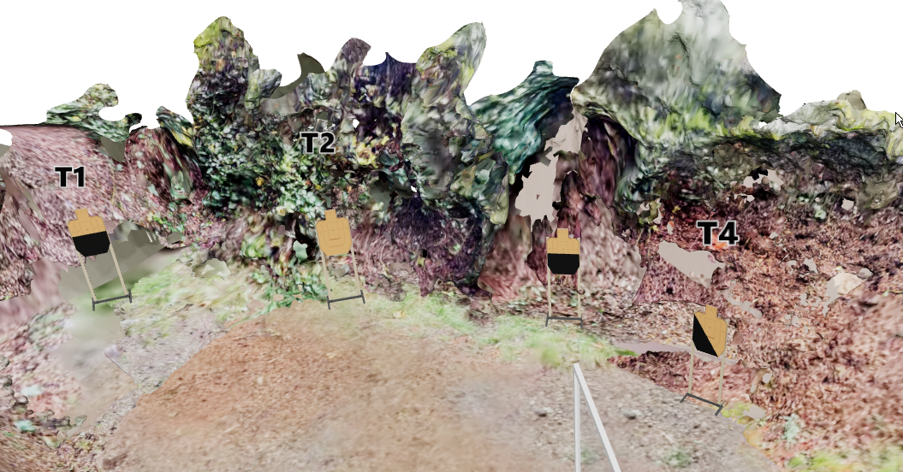
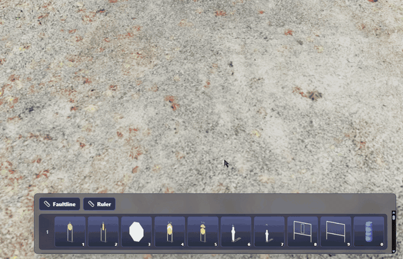
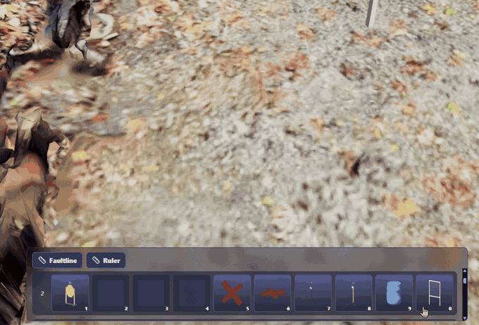
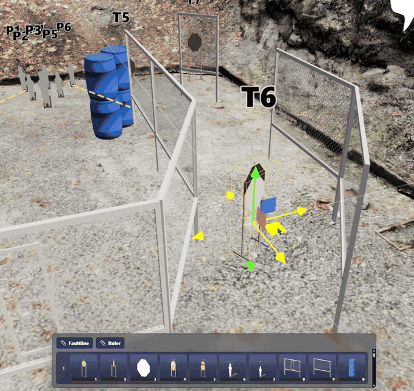
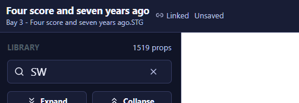

# Practism Designer Web — Feedback Log (Round 3)

**Tester:** Ken Wang
**App version / build:** _(fill in)_
**Browser / OS:** _(e.g. Chrome / Windows 11)_
**Test period:** 2026-08-19 → 2026-08-20

Previous rounds: [round 1 (001–010)](./PRACTISM-DESIGNER-FEEDBACK.md) · [round 2 (R01–R09)](./PRACTISM-DESIGNER-FEEDBACK-R2.md).
Media for this round lives in [`feedback-media-r3/`](./feedback-media-r3/), named `SNN-short-slug.png|gif|jpg` to match the item ID.

---

## Summary

| ID | Title | Type | Severity | Status |
|----|-------|------|----------|--------|
| S01 | Auto-number: assigned label doesn't render until the stage is reopened | Bug | Medium | Open |
| S02 | Support adding the current stage to a stage backlog for later match selection | Feature Request | High | Open |
| S03 | Number-key quick select ignores the active prop-bar row and is bound to fixed items | Bug | High | Open |
| S04 | Regression: fault line endpoints can no longer be dragged to move/resize | Bug | High | Open |
| S05 | "Face me" doesn't work on targets with a no-shoot/hardcover attached | Bug | Medium | Open |
| S06 | Title bar always shows "Unsaved" even after saving the STG and updating the stage in the match | Bug | Medium | Open |
| S07 | Allow editing in all stage states (Draft / Pending / Approved), not just Draft | Feature Request | High | Open |
| S08 | Prop color picker is very laggy while dragging the palette slider | Performance | Medium | Open |
| S09 | Generated WSBs are separate per-stage pages, so printing the whole match book is tedious | Feature Request | High | Open |
| S10 | Generate a printable QR code linking to the online match book | Feature Request | Medium | Open |
| S11 | Allow free-fly camera movement in match book walkthrough mode | Feature Request | Medium | Open |

**Type:** Bug · UX · Feature Request · Performance · Docs
**Severity:** Blocker · High · Medium · Low
**Status:** Open · Confirmed · Fixed · Won't Fix · Deferred

### Themes

**A. Match lifecycle beyond the single stage (S02, S07, S09, S10, S11)** — the dominant theme this round, and the biggest gap overall. The designer is strong at building one stage but thin on everything an MD does around that: banking stages between matches and picking from them later (S02), keeping stages editable once they leave Draft (S07), printing the whole match book in one pass (S09), getting it onto shooters' phones (S10), and making the walkthrough usable by the setup crew (S11). Individually these are feature requests; together they're the difference between a stage-drawing tool and a match-management tool.

**B. Direct manipulation keeps breaking (S03, S04, S05)** — the number-key quick select is bound to fixed items rather than the visible prop-bar row and does nothing once those items are removed (S03), fault line endpoint dragging has regressed and no longer moves or resizes (S04), and "Face me" silently fails on any target with a no-shoot or hardcover attached (S05). All three are core editing interactions that used to work or are expected to work, and all three fail silently rather than reporting an error.

**C. Attached/composite props are a blind spot (S05)** — "Face me" breaking specifically on targets with an attachment is the round-3 instance of a pattern that's now spanned every round: the app treats a prop plus its attachment as a case it wasn't designed for. Compare R07 (`ipsc-two-stack-noshoot` mislabeled as a no-shoot) and round 1 #001/#007/#008 (no-shoot attachment and snapping). Worth a single pass over how composite props are modeled rather than fixing each symptom.

**D. State display doesn't match reality (S01, S06)** — Auto-number assigns the right text but the label doesn't render until the stage is reopened (S01), and the title bar reports "Unsaved" even after saving the STG and updating the stage in the match (S06). Neither loses data, but both erode trust in the UI: if the save indicator is wrong, the MD can't tell a real unsaved change from a stale one.

**E. Performance (S08)** — the prop color picker is very laggy while dragging the palette slider, suggesting a full scene update per slider frame rather than a throttled or preview-only update.

### Suggested priority

1. **S04** — a regression in a core editing interaction; fault lines are on nearly every stage
2. **S03** — quick select is unusable and actively picks the wrong prop, which is worse than doing nothing
3. **S07** — Draft-only editing makes the Pending and Approved states impractical, so the whole approval workflow goes unused
4. **S02** — the single largest workflow gap; matches the way stages are actually built and scheduled
5. **S09** — every match needs the match book printed; the current per-stage pagination is manual work on match week
6. **S05, S06, S01** — silent failures and wrong status; individually small, collectively confidence-eroding
7. **S08** — noticeable friction but there's a workaround (drag less, or type the value)
8. **S10, S11** — high-value additions once the printing path in S09 is in place

### Cross-round notes

S01 continues the Auto-number thread that dominated round 2 (R03, R04, R07, R09), though this one is a render/refresh issue rather than data loss. S04 is a regression against fault line behavior that worked in earlier rounds, and echoes R02's endpoint-handle problems — endpoint manipulation is now the most regression-prone area across rounds. S05 extends the attached-prop theme from round 1 #001/#007/#008 and R07. S09/S10/S11 build on the match book and briefing work raised in R08. Round 1 #004 ("update stage in match") appears to have shipped, but S06 shows the title bar doesn't reflect it.

---

## S01 — Auto-number: assigned label doesn't render until the stage is reopened

- **Type:** Bug
- **Severity:** Medium
- **Status:** Open
- **Area:** Arrange / Auto-number targets · Label rendering
- **Date:** 2026-08-19

**Steps to reproduce**
1. Place a row of targets in the bay.
2. Run **Arrange → Auto-number targets**.
3. Inspect every target's label in the viewport.

**Expected**
Every scoring target immediately displays its assigned `TN` label.

**Actual**
Some targets are assigned a number but the label isn't drawn. In the screenshot, four targets are visible: T1, T2, an **unlabeled** target, and T4 — the third target shows no `T3` text.

**Confirmed: this is a render/refresh bug, not a data bug.**
- The Inspector's **Text** field for that target correctly contains `T3`.
- Closing and reopening the stage makes the label appear.

So Auto-number assigns the value correctly but the viewport label isn't refreshed for every affected target.

**Suggested fix**
Invalidate/rebuild the label sprite for every target touched by Auto-number, not just some. Likely a missed refresh on targets whose text changed but whose transform/geometry didn't.

**Why it matters**
The designer sees an unlabeled target and can't tell whether numbering failed. It also masks genuine numbering problems (round 2 R03/R09), making them harder to distinguish from a stale render.

**Media**

**Notes**
Distinct from round 2 R03, where the label loss was persistent and Undo couldn't restore it. Here the data is intact and a reload fixes it.
Related: R07, R09 — Auto-number remains the most defect-prone area.

---

## S02 — Support adding the current stage to a stage backlog for later match selection

- **Type:** Feature Request
- **Severity:** High
- **Status:** Open
- **Area:** Stage Central / Match management
- **Date:** 2026-08-19

**Context — how an MD actually works**
Stage design isn't organized around a single match. As a match director I design stages continuously between matches, building up a pool. When a match approaches, I pick a subset of that pool for the match book. Most designed stages aren't used in the *next* match — they wait for a later one, get revised, or get retired.

The app currently assumes stages belong to a match, so there's no natural home for a stage that isn't assigned to one yet.

**Request**
Add a **stage backlog** (library of unassigned stages) with:
1. An **"Add to backlog"** action for the current stage (File menu or Stage Central).
2. A backlog view listing all designed stages not tied to a match.
3. **Open and edit a stage directly from the backlog**, saving changes back to the backlog entry — without having to attach it to a match first. Backlog stages get revised repeatedly between matches (tweaking round count, fixing prop availability, reworking after a test run), so the backlog has to be a working library, not a write-only archive.
4. A **"Select stages from backlog"** flow when building a match — pick N stages from the pool and add them to the match book.

**Nice-to-haves**
- Metadata on each backlog entry to make selection easy: round count, target count, bay/bay-size requirement, prop requirements, COMSTOCK type, date designed.
- Usage history — "last used in 2026-06 match" — to avoid repeating a stage too soon for the same shooters.
- Tags/labels (e.g. `speed`, `long-range`, `needs-activators`, `bay-3-only`) and filtering.
- Duplicate-into-match semantics: adding a backlog stage to a match should copy it, so match-specific tweaks don't mutate the backlog original (or offer an explicit "link vs. copy" choice).
- A way to push improvements made in a match back to the backlog original ("update backlog copy from this stage"), for when a stage gets fixed during match prep.
- Version history or a revision date on backlog entries, so it's clear which iteration is current.
- Team/club-level backlog sharing, so multiple designers contribute to one pool.

**Why it matters**
This is the core workflow of running a club match series. Without a backlog, stages have to be parked in throwaway matches or exported as loose STG files and tracked outside the app — which is exactly the manual bookkeeping the tool should be removing.

**Media**

_(no media)_

**Notes**
Related: round 1 #004 (write an edited stage back to its originating match) — both are about the stage ↔ match relationship being managed inside the app rather than through file exports.

---

## S03 — Number-key quick select ignores the active prop-bar row and is bound to fixed items

- **Type:** Bug
- **Severity:** High
- **Status:** Open
- **Area:** Prop bar / Quick select hotkeys
- **Date:** 2026-08-19

**Steps to reproduce**
1. Open the quick-select prop bar at the lower center of the screen.
2. Switch to a different row of props.
3. Press `1` (or any number key).
4. Separately: remove the prop that a number key is bound to, then press that key.

**Expected**
Number keys act on the **currently displayed row** — `1`–`0` select the props visible in that row, so switching rows rebinds the keys to what's on screen. That's the whole point of a paged quick-select bar.

**Actual**
- Number keys always pick the same fixed items regardless of which row is active. In the GIF, pressing `1` always places the short IPSC target, even after switching to a row where slot 1 shows something else — the selected prop isn't even visible on screen.
- If the bound prop is removed from the bar, the number key does **nothing** — the binding isn't reassigned to whatever now occupies that slot.

**Why it matters**
The hotkeys are the fast path for placing props, and right now they're actively misleading: the bar shows one thing and the key does another, so props get placed by accident and have to be undone. Extra rows are effectively unreachable by keyboard, which defeats the purpose of paging the bar.

**Suggested fix**
- Bind number keys to slot positions in the **active row**, re-resolved whenever the row changes.
- Highlight the active row clearly, and show the slot number on each visible tile so the mapping is unambiguous.
- Never leave a key bound to a removed prop — a slot with no prop should be a no-op only because the slot is genuinely empty.

**Media**

**Notes**
GIF shows pressing `1` placing the short IPSC target regardless of which prop-bar row is selected.

---

## S04 — Regression: fault line endpoints can no longer be dragged to move/resize

- **Type:** Bug
- **Severity:** High
- **Status:** Open
- **Area:** 3D Canvas / Fault lines
- **Date:** 2026-08-19

**Steps to reproduce**
1. Place or select a fault line in the bay.
2. Grab one of its endpoints and drag.

**Expected**
Dragging an endpoint moves that end — repositioning and resizing the fault line in one gesture. This is how fault lines worked previously and is their primary editing interaction.

**Actual**
The endpoints no longer respond to dragging; the fault line can't be moved or resized this way. **Regression** — this worked in an earlier build.

**Why it matters**
Fault lines define the shooting area and get adjusted constantly while a stage is laid out. Endpoint dragging is the only practical way to fit them to the bay, so losing it blocks a core part of stage design. It also removes the interaction model that round 1 #009 asked to extend to walls.

**Media**

**Notes**
Second endpoint-manipulation regression in as many rounds — see round 2 R02, where wall endpoint rotation shipped with a single hard-coded pivot. Worth checking whether both share a common endpoint/handle picking change.

---

## S05 — "Face me" doesn't work on targets with a no-shoot/hardcover attached

- **Type:** Bug
- **Severity:** Medium
- **Status:** Open
- **Area:** Arrange / Face camera · Composite targets
- **Date:** 2026-08-19

**Steps to reproduce**
1. Place a target and attach a no-shoot (or hardcover) to it.
2. Select that target.
3. Run **Face me** / **Face camera**.

**Expected**
The target rotates to face the current camera, exactly as a plain target does — and the attached no-shoot rotates with it, preserving their relative arrangement.

**Actual**
Nothing happens on targets that have a no-shoot/hardcover attached. Plain targets orient correctly, so the presence of the attachment is what breaks it.

**Why it matters**
"Face me" (requested as round 1 #010) is the fastest way to square targets to a shooting position, and partially covered targets are exactly the ones whose angle matters most — the amount of exposed target depends on the facing. Falling back to the manual gizmo for these is especially painful given round 1 #002's rotation-axis issues.

**Suggested fix**
- Resolve the operation against the composite/parent object so an attached no-shoot doesn't block the rotation, and rotate the attachment along with its target.
- If the attachment causes the selection to resolve to something non-rotatable, surface a message instead of silently doing nothing.

**Media**

**Notes**
Related: round 1 #010 (the "Face me" request) and #002 (rotation axes). Also fits round 2's theme B — composite/attached relationships aren't handled consistently by operations that work fine on single props.

---

## S06 — Title bar always shows "Unsaved" even after saving the STG and updating the stage in the match

- **Type:** Bug
- **Severity:** Medium
- **Status:** Open
- **Area:** Title bar / Save state indicator
- **Date:** 2026-08-19

**Steps to reproduce**
1. Open a match-linked stage and make an edit.
2. **File → Save STG** to save locally.
3. Also update the stage in the match.
4. Look at the status next to the stage name in the title bar.

**Expected**
The indicator switches to a saved state (or clears) once the design has been persisted, and only returns to "Unsaved" after a subsequent edit.

**Actual**
The title bar shows **Unsaved** permanently — it never clears, no matter how the stage is saved. The screenshot shows the stage marked `Linked` and `Unsaved` immediately after both saving the STG and updating the match.

**Why it matters**
A save indicator that's always dirty is worse than none: it can't be used to tell whether work is safe, so there's no way to know if a stage still has unsaved changes before closing the tab or moving on. That's a real risk of losing work during a pre-match editing session.

**Suggested fix**
- Clear the dirty flag on a successful Save STG and on a successful match update.
- Show what the state refers to — e.g. "Saved to match · 2 min ago" vs. "Unsaved changes" — since a stage can be saved locally but not pushed to the match, and those are different states worth distinguishing.

**Media**

**Notes**
Screenshot shows the title bar for "Four score and seven years ago" (`Bay 3 - Four score and seven years ago.STG`) marked `Linked` / `Unsaved` right after saving.
Related: round 1 #004 — the match round-trip; a trustworthy saved-state indicator matters more once stages are written back to a match directly.

---

## S07 — Allow editing in all stage states (Draft / Pending / Approved), not just Draft

- **Type:** Feature Request
- **Severity:** High
- **Status:** Open
- **Area:** Stage states / Editing permissions
- **Date:** 2026-08-19

**Context**
Stages have three states today: **Draft**, **Pending**, and **Approved**. Only stages in **Draft** can be edited. In practice this makes Pending and Approved impractical to use — moving a stage out of Draft means giving up the ability to touch it, so the natural workaround is to keep everything in Draft and ignore the state model entirely.

**Request**
Allow edits in every state. Keep the states as *status labels* describing where a stage sits in the review process, not as an editing lock.

**Why**
1. **A separate lock feature already exists.** A designer who genuinely wants to prevent changes can lock the stage explicitly. Tying immutability to review status is redundant and takes the decision away from the person who should make it.
2. **Changelog history now exists for stages.** The original justification for freezing a stage — protecting it from unreviewable changes — is covered by history: edits are recorded and can be inspected or reverted. If the concern is edits sneaking in after approval, surface them (e.g. flag "modified since approval") instead of blocking them.
3. **Real MD workflow requires constant small edits.** Stages get touched right up to match morning, and most edits are trivial — repositioning a camera for a better briefing image, adjusting a ruler, fixing a typo in the briefing, swapping a prop that turned out to be unavailable. None of these change the competitive design, but the Draft-only restriction blocks them exactly when the stage is Approved and closest to being used.

**Impact today**
Either the state model goes unused (everything stays in Draft), or editing an Approved stage means reverting it to Draft — or duplicating it, editing the copy, and re-attaching — which fragments history, breaks the match link, and creates the "which version is current?" confusion that states were meant to prevent.

**If some protection must stay**
- Make it a warning rather than a block ("this stage is Approved — continue editing?").
- Auto-flag the stage as *modified since approval* so a reviewer can see what changed, rather than preventing the change.
- Always allow presentation-only edits (camera, ruler, briefing text) in any state.
- Rely on the existing lock plus changelog for everything else.

**Media**

_(no media)_

**Notes**
Related: S02 (backlog stages need to be editable in place) and S06 (save-state clarity). All three point the same direction: a stage should be a living document the MD can revise, with history, status labels, and locking providing safety rather than hard immutability.

---

## S08 — Prop color picker is very laggy while dragging the palette slider

- **Type:** Performance
- **Severity:** Medium
- **Status:** Open
- **Area:** Inspector / Material Colors · Color picker
- **Date:** 2026-08-19

**Steps to reproduce**
1. Select a prop that supports a custom color (e.g. a fault line).
2. Open the color picker in the Inspector.
3. Drag the slider across the palette.

**Expected**
The color updates smoothly as the slider moves, so a color can be dialed in by eye in one gesture.

**Actual**
Dragging the slider is very laggy — updates stutter and trail well behind the cursor, making it hard to land on a specific color. Picking a color takes several attempts.

**Likely cause**
The scene (or the prop's material) is probably being fully re-applied/re-rendered on every slider input event. Fault lines in particular can be numerous in a stage, so if the update touches all of them — or triggers a full scene refresh — the cost per event would be high.

**Suggested fix**
- Throttle/debounce the live preview during drag and commit the final value on release.
- Update only the affected prop's material rather than triggering a broader scene update.
- If a full-scene recolor is genuinely needed (e.g. "apply to all fault lines"), do it once on commit rather than on every intermediate value.

**Media**

_(no media)_

**Notes**
Worth confirming whether the lag scales with the number of props in the stage — that would point at a scene-wide update on each input event.

---

## S09 — Generated WSBs are separate per-stage pages, so printing the whole match book is tedious

- **Type:** Feature Request
- **Severity:** High
- **Status:** Open
- **Area:** Match book / WSB output · Printing
- **Date:** 2026-08-19

**Context**
One-click match book generation already exists, and briefing templates are supported. The gap is purely in the **output format**: each stage's WSB comes out as its own separate page/view, so there's no single artifact to send to a printer.

**Problem**
Printing the WSBs for a match means visiting and printing each stage's page one at a time, then collating by hand — repeated for 7+ stages, and repeated again whenever a stage changes late. It's mechanical, and it's easy to end up with a missing or stale page.

**Request**
Provide a **combined, print-ready document** containing every stage's WSB — one stage per printed page, in stage order, with proper page breaks — that can be printed or exported to PDF in a single action.

**Details**
- Single continuous document with a page break between stages, rather than separate per-stage pages.
- Paginate cleanly on Letter/A4 so each stage lands on its own sheet.
- Export to PDF as well as a browser print view.
- Regenerated from current stage data at print time, so a late stage edit can't leave a stale page behind.

**Nice-to-haves**
- Include/exclude specific stages (e.g. skip a stage still Pending).
- Toggle the stage diagram/viewport image per page — some MDs post text-only WSBs, others include the layout.
- Consistent header/footer with match name and page numbers, for reassembling after printing.
- Optional cover page with match name, date, and club.

**Media**

_(no media)_

**Notes**
This is an output/pagination change on top of existing match book generation, not a new generation feature.
Related: R08 (briefing template persistence) — consistent wording across stages matters more once they're printed as one document.

---

## S10 — Generate a printable QR code linking to the online match book

- **Type:** Feature Request
- **Severity:** Medium
- **Status:** Open
- **Area:** Match book / Sharing & printing
- **Date:** 2026-08-20

**Request**
Generate a **print-ready QR code** for a match's online match book, so it can be printed and posted at the match site for shooters to scan and read the stages on their phones.

**Why**
Shooters want to study stages while waiting on a squad, but paper WSBs are posted one per bay and often crowded around. A scannable link gives everyone the whole match book on their own phone, cuts printing volume, and — unlike paper — always shows the current version if a stage changes.

**Details**
- QR code encoding a public, read-only match book URL that doesn't require login or an account.
- Print-ready output: a sheet with the QR code plus the match name and date, sized large enough to scan from a few feet away.
- Optionally a per-stage QR code, so each bay's posted sheet can link straight to that stage's briefing and diagram.
- Include the QR code as part of the match book document (cover page and/or per-stage page header) — see S09.
- Mobile-friendly rendering on the linked page: readable WSB text and a legible stage diagram on a phone screen.

**Nice-to-haves**
- Link stays valid if stages are edited after printing, so the posted code never goes stale.
- Option to expire or unpublish the link after the match.
- Downloadable QR image (PNG/SVG) so it can be dropped into a club's own signage or match announcement.

**Media**

_(no media)_

**Notes**
Pairs naturally with S09 — printed WSBs at each bay plus one scannable link to the full match book covers both the on-the-line and the waiting-around use cases.

---

## S11 — Allow free-fly camera movement in match book walkthrough mode

- **Type:** Feature Request
- **Severity:** Medium
- **Status:** Open
- **Area:** Match book / Walkthrough & camera
- **Date:** 2026-08-20

**Request**
Add a **fly mode** to the match book's walkthrough view, so the camera can leave the ground plane and move freely up, down, and over the stage instead of being locked to a shooter's-eye walking path.

**Why**
The walkthrough is currently framed around a competitor's perspective, which is the right default for shooters. But the same match book is the most convenient reference for the **setup crew**, and they need a different view: looking down at the bay to see where every prop, wall, and target actually sits relative to each other and to the bay boundaries. Being able to rise above the stage and orbit makes it far easier to lay out props correctly on match morning without opening the full designer.

**Details**
- Free-fly controls in the walkthrough: move up/down in addition to forward/back/strafe, plus look around.
- Ability to get a top-down or high-angle view of the whole stage, then descend back to eye level.
- Keep the existing ground-locked walking mode as the default; fly mode should be an explicit toggle so the shooter experience is unchanged.
- Works on the shared/online match book (see S10), not just inside the designer — the setup crew will be viewing it on a phone or tablet in the bay.

**Nice-to-haves**
- A quick "top view" preset button that snaps straight to an overhead shot of the stage.
- Optional distance/measurement readout or ground grid while flying, to help place props at the right offsets.
- Remember the last camera mode per user so setup crew members don't have to re-enable fly mode on every stage.

**Media**

_(no media)_

**Notes**
Setup-crew-oriented companion to S09 and S10: those cover getting the match book into people's hands on paper and on their phones; this covers making the 3D view actually useful for the people building the stages.

---

<!--
COPY THIS BLOCK FOR EACH NEW ITEM

## SNN — title

- **Type:**
- **Severity:**
- **Status:** Open
- **Area:**
- **Date:**

**Steps to reproduce**
1.

**Expected**

**Actual**

**Media**

**Notes**

---
-->
