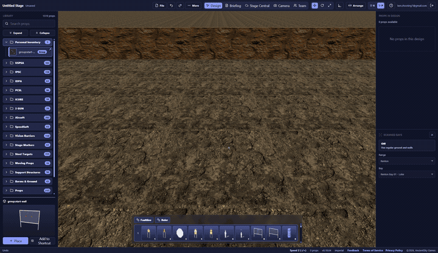
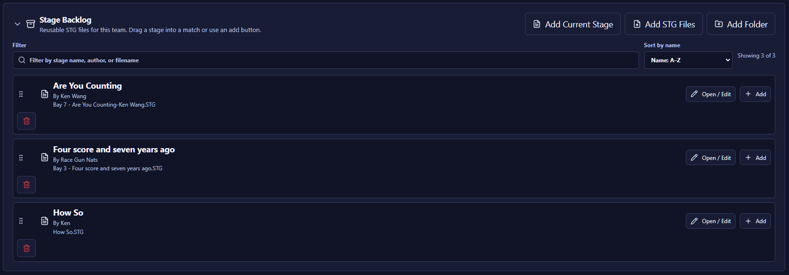
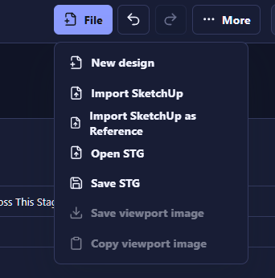
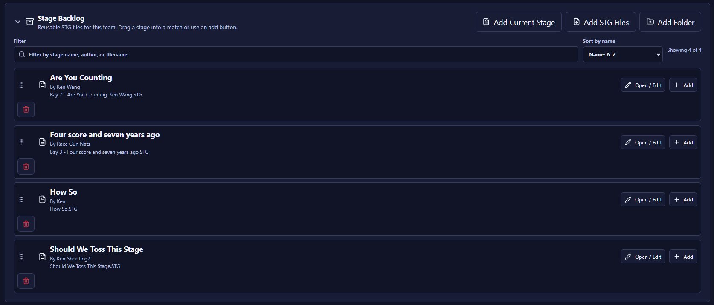
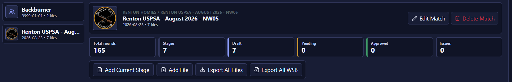
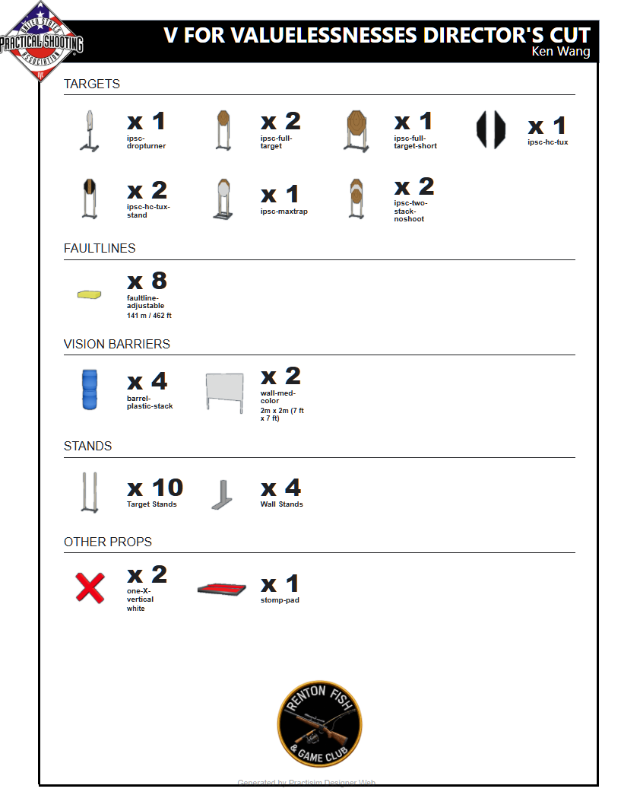

# Practism Designer Web — Feedback Log (Round 4)

**Tester:** Ken Wang
**App version / build:** _(fill in)_
**Browser / OS:** _(e.g. Chrome / Windows 11)_
**Test period:** 2026-08-20 → 2026-08-21

Previous rounds: [round 1 (001–010)](./PRACTISM-DESIGNER-FEEDBACK.md) · [round 2 (R01–R09)](./PRACTISM-DESIGNER-FEEDBACK-R2.md) · [round 3 (S01–S11)](./PRACTISM-DESIGNER-FEEDBACK-R3.md).
Media for this round lives in [`feedback-media-r4/`](./feedback-media-r4/), named `TNN-short-slug.png|gif|jpg` to match the item ID.

---

## Summary

| ID | Title | Type | Severity | Status |
|----|-------|------|----------|--------|
| T01 | Hardcover renders tan instead of black | Bug | Medium | Open |
| T02 | Stage Backlog: delete button is orphaned on the left, away from Open/Edit and Add | UX | Low | Open |
| T03 | File menu: add "Add current stage to match" and "Add current stage to backlog" for unlinked stages | Feature Request | High | Open |
| T04 | Stage Backlog at scale: bay/round-count metadata, usage tracking, auto-pick by bay, and match→backlog drag | Feature Request | High | Open |
| T05 | Generate Matchbook silently discards the stage currently being edited | Bug | High | Open |
| T06 | "Export All WSB" should let you pick a template for that export only | Feature Request | High | Open |
| T07 | Match-level prop usage rollup, to catch designs that exceed range equipment stock | Feature Request | High | Open |
| T08 | Browser page title should name the stage when viewing/walking a stage from the match book | UX | Low | Open |
| T09 | Team view resets to the first match on page refresh instead of remembering the selection | Bug | Medium | Open |
| T10 | Designer resets to an Untitled Stage on refresh instead of reloading the open match/backlog stage | Feature Request | Medium | Open |
| T11 | Per-stage match book telemetry (WSB views, fly-throughs) surfaced on the match management page | Feature Request | Medium | Open |

**Type:** Bug · UX · Feature Request · Performance · Docs
**Severity:** Blocker · High · Medium · Low
**Status:** Open · Confirmed · Fixed · Won't Fix · Deferred

### Themes

**A. The match is now the unit of work, and it's under-served (T04, T05, T06, T07, T11)** — rounds 1–3 were mostly about building a single stage. This round is almost entirely about running a *match*: choosing stages from a growing backlog (T04), rolling up prop usage against what the range actually owns (T07), exporting different WSB views for different audiences (T06), and knowing whether the match book reached anyone (T11). T05 belongs here too — a match-wide operation reaching in and clobbering the stage editor. The single-stage tooling is in good shape; the match-assembly layer around it is where the work now is.

**B. Browser state isn't the app's state (T08, T09, T10)** — the team view forgets the selected match on refresh (T09), the designer resets to Untitled (T10), and the page title never names what's open (T08). All three are the same gap: what's currently open isn't reflected in the URL or the document title, so refresh, bookmarks, history, and the tab strip all work against the user. Likely one piece of routing work covering all three, and it would make stages and matches linkable as a side effect.

**C. Destructive operations without guardrails (T05)** — Generate Matchbook silently discards unsaved work in the editor, with no warning, no restore, and no indication beforehand that it touches the editor at all. Worth auditing whether other multi-stage operations behave the same way.

**D. Prop fidelity (T01)** — hardcover renders tan rather than black, reproducible on a brand-new stage. Small, but it reaches the printed match book: if hardcover isn't visually distinct, the diagram doesn't convey what's covered.

**E. Placement and polish (T02, T03)** — the backlog's delete button is stranded on the left away from the other row actions (T02), and the File menu offers Update paths for linked stages but no Add paths for unlinked ones (T03). Both are cases where a shipped feature is one placement decision away from being complete.

### Suggested priority

1. **T05** — silent loss of unsaved work, triggered by a routine operation that gives no warning
2. **T04** — the backlog is filling up faster than it's consumed; without bay, round count, and usage data, match assembly is manual matching
3. **T06** — a temporary export need currently forces a permanent match-wide template change that's easy to forget undoing
4. **T07** — an over-budget prop found on setup morning is a real problem; found while designing it's a five-minute fix
5. **T09, T10** — hit on every refresh; likely one routing fix, and it makes matches and stages linkable
6. **T03** — completes the stage↔match↔backlog linking model
7. **T01** — visible in the match book, and probably a one-line material fix
8. **T11, T08, T02** — visibility and polish

### Cross-round notes

Several round 3 requests have shipped and this round builds directly on them: **S02** (stage backlog) is live — T02 and T04 refine it, and T04 addresses the "many stages" case S02 anticipated. Round 1 **#004** (update stage in match) is live — T03 asks for the matching *add* actions. **R08** (briefing templates) leads into T06's export-time template override. **S09/S10/S11** (match book printing, QR sharing, fly mode) are what T11's telemetry would measure, and T08 helps shooters landing from a QR code.

Continuing threads: T05 and S06 both concern the editor's save state being unreliable or ignored; T01 extends the attached/composite-prop weak spot seen in S05, R07, and round 1 #001/#007/#008.

---

## T01 — Hardcover renders tan instead of black

- **Type:** Bug
- **Severity:** Medium
- **Status:** Open
- **Area:** Props / Materials & rendering
- **Date:** 2026-08-20

**Steps to reproduce**
1. Create a brand new stage from scratch.
2. Place a target with hardcover (or add hardcover to a target).
3. Look at the hardcover surface in the 3D view.

**Expected**
Hardcover renders **black**, matching how hard cover is painted in the real world and how it's shown in USPSA stage diagrams. The contrast against the tan/brown target cardboard is what makes hardcover readable at a glance.

**Actual**
Hardcover renders in a **tan/brown color** that's very close to the target cardboard color, so it doesn't read as hardcover at all. Reproduced on a brand new stage built from scratch, so it isn't carried over from an existing stage file or a prior color edit.

**Suggested fix**
Set the default hardcover material to black. Worth checking whether the hardcover prop is falling back to the generic cardboard/target material rather than having its own — the color being *exactly* in the target-cardboard family suggests a missing material assignment rather than a wrong color value.

**Media**



**Notes**
Affects the printed match book as well as the 3D view — if hardcover isn't visually distinct in the stage diagram, shooters and ROs can't tell covered scoring area from open. Related to S05 (round 3), where "Face me" fails on targets with hardcover/no-shoot attached; hardcover as a prop type may be under-specified generally.

---

## T02 — Stage Backlog: delete button is orphaned on the left, away from Open/Edit and Add

- **Type:** UX
- **Severity:** Low
- **Status:** Open
- **Area:** Stage Backlog / Layout
- **Date:** 2026-08-20

**Observed**
In the Stage Backlog list, each row's **delete (trash) button** sits alone on the far left, on its own line below the drag handle and file icon. The row's other actions — **Open / Edit** and **Add** — are grouped together on the far right.

**Expected**
All per-row actions live in one place. Delete should join **Open / Edit** and **Add** in the right-hand action group, so a row reads as: identity on the left (drag handle, stage name, author, filename), actions on the right.

**Why**
- Splitting actions across both ends of a wide row means scanning left *and* right to find what you can do with a stage.
- The current placement pushes each row taller than it needs to be — the trash button occupies its own line, so three backlog entries fill the panel.
- The isolated left position reads as though the trash belongs to the drag handle or the file icon rather than to the row as a whole.

**Suggested fix**
Move delete into the right-hand button group, after Add. Keep it visually de-emphasized (icon-only, red on hover) so it doesn't compete with the primary actions, and consider a confirmation step or undo since it removes a stage from the team's reusable library. Once the trash button is out of the left column, each row should collapse to a single line.

**Media**



**Notes**
The Stage Backlog itself is the feature requested in S02 (round 3) — good to see it shipped, including the "Add Current Stage" button and per-row **Open / Edit**, which covers the in-backlog editing follow-up. This item is purely about button placement within it.

---

## T03 — File menu: add "Add current stage to match" and "Add current stage to backlog" for unlinked stages

- **Type:** Feature Request
- **Severity:** High
- **Status:** Open
- **Area:** File menu / Stage–match–backlog linking
- **Date:** 2026-08-20

**Request**
When the current stage is **not** already linked to a match or the backlog — i.e. it was created new, imported, or opened from an STG file — the File menu should offer two "add" actions:

1. **Add current stage to `<match name>`** — adds it to the most recently opened match, with the match name shown in the menu item so it's clear where it's going.
2. **Add current stage to Stage Backlog** — adds it to the team's reusable backlog.

**Why**
These are the missing counterparts to the existing **Update stage in match** and **Update backlog stage** items, which only appear once a stage is already linked. Right now a stage that came from a file has no in-editor path into a match or the backlog at all — the File menu offers only New design, Import SketchUp, Open STG, and Save STG (see screenshot). The workflow has a dead end: build or import a stage, then leave the designer and go add it from the other side.

Completing the matrix makes the linking model symmetric and predictable:

| Stage origin | Update (exists today) | Add (requested) |
|---|---|---|
| Opened from a match | Update stage in match | — |
| Opened from the backlog | Update backlog stage | — |
| New / imported / opened from STG | — | **Add to match**, **Add to backlog** |

**Details**
- Show the target match name in the menu label rather than a generic "current match", so there's no doubt which match is being modified — an MD often has several open across a season.
- Both actions should stay available together; adding to the backlog and adding to a match aren't mutually exclusive, and a stage frequently belongs in both.
- After the add succeeds, the stage should become linked, so the menu naturally switches over to the corresponding **Update…** item and the title bar reflects the link.
- Grey out or hide **Add to match** when no match has been opened this session, rather than silently doing nothing.

**Media**



**Notes**
Direct follow-on to S02 (stage backlog, now shipped) and round 1 #004 (update stage in match, shipped). Those covered the update path; this covers the add path. Also related to S06 — the title bar's link/save state should update correctly once a stage is added this way.

An **Add Current Stage** button does exist in the match panel and in the Stage Backlog panel (see the T04/T06 screenshots), so the capability is partly there — the gap is that it isn't reachable from the File menu while designing, which is where the corresponding **Update…** items live. Having both paths in the same menu is what makes the model predictable.

---

## T04 — Stage Backlog at scale: bay/round-count metadata, usage tracking, auto-pick by bay, and match→backlog drag

- **Type:** Feature Request
- **Severity:** High
- **Status:** Open
- **Area:** Stage Backlog / Match assembly
- **Date:** 2026-08-20

**Request**
The Stage Backlog works well with a handful of stages, but as it fills up over a season, picking stages for a match becomes the hard part. Today a backlog row shows only stage name, author, and filename — nothing that helps answer "which of these fits Bay 4, and have I already run it?" Five improvements, roughly in dependency order:

**1. Show the scanned bay name on each backlog entry**
Surface the bay the stage was designed against as a first-class field on the row, not buried in the filename. Some entries happen to carry it (`Bay 7 - Are You Counting-Ken Wang.STG`, `Bay 3 - Four score and seven years ago.STG`) purely because the MD typed it there; others don't (`How So.STG`, `Should We Toss This Stage.STG`). Since the stage is designed against a scanned bay, the app already knows this — it should display it, and it should be filterable and sortable by bay.

**2. Track usage, or remove from the backlog on Add**
There's currently no way to tell whether a backlog stage has already been run. Two options:
- **Usage log (preferred):** show which matches have used the stage and when — e.g. "Used: Renton 2026-06, Renton 2026-08". Keeps the stage available for deliberate reuse while making accidental repeats obvious.
- **Consume on Add:** remove the stage from the backlog when **Add** puts it into a match.

The usage log is the better fit because a good stage is worth running again after enough time — the problem is only running it again *too soon*, or setting up the same stage twice in one match.

**3. Show round count on each entry**
Round count is the first thing an MD checks when balancing a match, and it drives scoring, timing, and stage order. Showing it in the list avoids opening each stage to find out.

**4. Auto-pick one stage per bay (builds on #1)**
Given a bay range — Renton runs Bay 1 through Bay 7 — try to fill each bay with one stage from the backlog, and **clearly flag any bay with no available design**. If the target match already has a stage assigned to a bay, skip that bay rather than replacing it. The selection algorithm can evolve; a reasonable v1 is **most recently designed first**. Natural refinements later: prefer stages not recently used (from #2), and balance total round count across the match (from #3).

**5. Support dragging a stage from a match back into the Backlog**
Dragging from the Backlog into a match already works; the reverse doesn't. Match → Backlog drag would let an MD promote a stage that turned out well into the reusable library without re-exporting it, and would make the two panels feel like one workspace rather than a one-way pipe.

**Why**
This is the practical bottleneck in assembling a match. An MD designs stages continuously between matches, so the backlog grows much faster than it's consumed, and the metadata needed to choose from it — bay, round count, whether it's been run — lives in the designer's head or in ad-hoc filename conventions. Items 1–3 make the list self-describing; item 4 turns match assembly into a review step instead of a manual matching exercise; item 5 closes the loop so stages flow both directions.

**Media**



**Notes**
Extends S02 (backlog, shipped) with the "many stages" case that S02 anticipated but didn't specify. Item 5 pairs with T03 — both are about stages moving freely between file, backlog, and match. Item 1 is a prerequisite for item 4.

---

## T05 — Generate Matchbook silently discards the stage currently being edited

- **Type:** Bug
- **Severity:** High
- **Status:** Open
- **Area:** Match book / Editor state
- **Date:** 2026-08-20

**Steps to reproduce**
1. Open or create a stage and make edits to it in the designer.
2. Without saving, run **Generate Matchbook** for the match.
3. Watch the viewport as generation runs.

**Expected**
Generating the match book is a read-only reporting operation. It should not disturb the editor: the stage that was open before should still be open, with the same unsaved edits, when generation finishes. If the implementation genuinely can't avoid loading stages into the viewport, the app should at minimum warn first and offer to save.

**Actual**
Generation loads every stage in the match into the designer one after another, and the stage being worked on is **overwritten with no warning and no way back** — whatever was in the editor is simply gone. There's no confirmation prompt beforehand and no restore afterward; the editor is left sitting on whatever stage happened to be loaded last.

**Impact**
Straightforward loss of unsaved work, triggered by an operation that gives no indication it will touch the editor at all. Generating the match book is something an MD does repeatedly while finishing a match, often in the middle of tweaking a stage, so this is easy to hit.

**Suggested fix**
1. **Preserve and restore.** Capture the current stage and its edit state before generation starts, and restore it — including unsaved changes and ideally the camera — when generation completes or fails.
2. **Block editing during generation.** While stages are being cycled through, put the editor into a busy/read-only state with clear progress ("Generating match book — stage 3 of 7"), so edits can't be made against a stage that's about to be swapped out.
3. **Warn if it can't be made safe.** If preserving state isn't feasible in the near term, prompt before starting: "Generating the match book will close the stage you're editing. Save changes first?" with Save / Discard / Cancel.
4. Longer term, generate off-screen (a background or offscreen renderer) so the operation never touches the active editor session.

**Media**

_(no media)_

**Notes**
Also worth checking whether other multi-stage operations take over the editor the same way. Related to S06 — if the editor's saved/unsaved state is already unreliable in the title bar, an MD has no warning signal before triggering this. Match book behavior is also covered by S09 (pagination) and S10 (QR sharing).

---

## T06 — "Export All WSB" should let you pick a template for that export only

- **Type:** Feature Request
- **Severity:** High
- **Status:** Open
- **Area:** Match book / WSB templates & export
- **Date:** 2026-08-20

**Request**
Add a **template picker to "Export All WSB"** so a specific template can be used for one export without changing what's stored on the stages.

**Scenario**
I built a separate WSB template for the **build crew** — different information than what shooters see. To produce that version today I have to:

1. Apply the build-crew template to every stage in the match.
2. Run **Export All WSB**.
3. Apply the original template back to every stage.

Step 3 is the problem. It's manual, it's per-stage, and if I forget it or get interrupted, the next match book generation publishes the build-crew WSBs to the shooters. The template lives on the stage, so a temporary export need forces a permanent, match-wide, easily-forgotten mutation.

**Expected**
Choosing a template at export time is a property of *that export*, not of the stages. Clicking **Export All WSB** should offer: use each stage's current template (default), or override with a selected template for this export only. Stage data is untouched either way.

**Details**
- Template dropdown in the Export All WSB dialog, defaulting to the current per-stage templates so existing behavior is unchanged.
- The override applies to every stage in that export, so build-crew output is consistent even if stages have drifted to different templates.
- Include the template name in the exported filenames (e.g. `… - Build Crew.pdf`), so the two versions can't be confused once they're sitting in the same folder.
- Same option would be useful on **Generate Matchbook** and on the S09 combined print output.

**Why**
Different audiences need different WSB content from the same stages — shooters, build crew, ROs, setup diagrams. The stage should carry one canonical template while exports stay free to render whatever view they need. Without that split, every alternate audience means round-tripping the whole match through a template change and hoping the restore doesn't get missed.

**Media**



**Notes**
Builds on R08 (briefing template not preserved, with a request for match/team/user scoping) — this is the export-time counterpart to that stage-level scoping request. Also relates to S09/S10: a build-crew WSB set is a good example of an output that needs its own pagination and never belongs in the public match book.

---

## T07 — Match-level prop usage rollup, to catch designs that exceed range equipment stock

- **Type:** Feature Request
- **Severity:** High
- **Status:** Open
- **Area:** Match view / Equipment planning
- **Date:** 2026-08-20

**Request**
Add an **overall prop usage view to the match**, aggregating what every stage in the match consumes — the same content as the per-stage **Build List**, summed across all stages.

**Why**
The per-stage Build List answers "what do I need for this bay." It doesn't answer the question that actually blocks a match: **does the range own enough of it?** A club has a fixed inventory — so many target stands, walls, barrels, fault lines — and each stage is designed independently, so it's easy to end up needing 60 target stands when the range owns 45. Today the only way to find out is to add up seven Build Lists by hand, or to discover it on setup morning when the crew runs out.

A match-level rollup turns that into something the app can just tell me, early, while stages can still be adjusted.

**Details**
- Aggregate counts per prop type across all stages in the match, grouped the same way the Build List already groups them (Targets, Faultlines, Vision Barriers, Stands, Other Props).
- **Dynamically updated** — it reflects the current state of the match's stages at all times. This is a live view, **not** tied to WSB or match book generation; I need it while designing, not as a byproduct of producing documents.
- Show the per-stage breakdown behind each total (expand a row to see "Bay 3: 4, Bay 5: 2, …"), so an over-budget prop can be traced to the stages driving it.
- Totals for cumulative measures too, like total fault line length — the Build List already reports this per stage (e.g. "141 m / 462 ft").

**Ideally, with inventory awareness**
- Let a team record its equipment quantities once (range inventory per prop type).
- Flag any prop where match usage exceeds stock, with the overage called out clearly.
- Show remaining headroom on the rest, so it's obvious how much room is left before adding another stage tips something over.

**Media**

Per-stage Build List, for reference — the match view should roll this up across all stages:



**Notes**
Pairs with T04 (round count and bay metadata in the backlog): both are about giving the MD the numbers needed to assemble a workable match before setup day. Deliberately independent of S09/T06 export work — this is an in-app planning view, not a document.

---

## T08 — Browser page title should name the stage when viewing/walking a stage from the match book

- **Type:** UX
- **Severity:** Low
- **Status:** Open
- **Area:** Match book / Browser integration
- **Date:** 2026-08-20

**Request**
When viewing or walking an individual stage from the match book, set the browser page title to:

```
<Stage name> - <Match name> - Practisim Designer Web
```

**Why**
Reviewing a match book means opening several stages at once, and browser tabs are how you keep track of them. If every tab carries the same generic title, the tab strip is useless — you're clicking through tabs to find the one you wanted. Most-specific-first ordering also matters, since tabs truncate from the right: the stage name is what needs to survive the truncation.

Secondary benefits, all of which come free with a correct title:
- Bookmarks and browser history entries become identifiable — useful for a stage the MD keeps returning to.
- Back/forward navigation is readable in the history dropdown.
- A shared link or a screenshot of the window carries the stage name with it.
- Printing to PDF from the browser picks up the title, so saved stage pages aren't all named the same thing.

**Details**
- Apply the same pattern throughout, so titles stay predictable: match view → `<Match name> - Practisim Designer Web`; designer → `<Stage name> - Practisim Designer Web`.
- Update the title on client-side navigation too — moving between stages within the match book should retitle the tab, not leave the previous stage's name in place.

**Media**

_(no media)_

**Notes**
Related to S10 (QR codes into the online match book) — shooters landing on a stage page from a scanned code benefit the same way when they save or share the link. Also adjacent to S06: the in-app title bar and the browser title should agree on what's currently open.

---

## T09 — Team view resets to the first match on page refresh instead of remembering the selection

- **Type:** Bug
- **Severity:** Medium
- **Status:** Open
- **Area:** Team view / Navigation & state
- **Date:** 2026-08-20

**Steps to reproduce**
1. Open the team view.
2. Select a match other than the first one in the left-hand list (e.g. `Renton USPSA - August 2026 - NW05` when `Backburner` is at the top).
3. Refresh the page.

**Expected**
The previously selected match is still selected after the refresh.

**Actual**
The selection resets to the **topmost entry** in the list. Whatever match was being worked on has to be found and re-selected on every refresh.

**Impact**
Low-stakes individually, but it lands on the most repeated action in the app. Match prep involves a lot of refreshing, and the top item is often *not* the working match — a long-lived bucket like `Backburner` sorts above the current match, so the reset consistently lands on the wrong one. It also makes the browser Reload button feel destructive, which is the wrong instinct to train.

**Suggested fix**
Preferred: **put the selected match in the URL** (e.g. `/team/<team>/match/<match-id>`). That fixes refresh, and also makes the selection linkable, bookmarkable, and correct under browser back/forward — none of which a stored preference gives you.

If the URL can't carry it, persist the last-selected match per user/team in local storage and restore it on load, falling back to the first entry when the stored match no longer exists.

**Media**

_(no media)_

**Notes**
Same underlying theme as T08 — the app's state isn't reflected in the browser's model of the page (title, URL, history), so normal browser behavior like refresh and tab-switching works against the user. Fixing both together is likely one piece of routing work.

---

## T10 — Designer resets to an Untitled Stage on refresh instead of reloading the open match/backlog stage

- **Type:** Feature Request
- **Severity:** Medium
- **Status:** Open
- **Area:** Designer / Navigation & state
- **Date:** 2026-08-20

**Steps to reproduce**
1. Open a stage from a match or from the Stage Backlog.
2. Refresh the page.

**Expected**
The stage reloads, still linked to the match or backlog entry it came from.

**Actual**
The designer resets to a blank **Untitled Stage**. The stage has to be located and reopened from the match or the backlog every time.

**Scope**
This applies specifically to stages with a known source — opened from a **match** or from the **Stage Backlog** — where the app can reload from the server without needing anything from the local filesystem. A stage opened from a local STG file can't be restored the same way (browsers won't re-read a file without user action), so falling back to Untitled there is reasonable; a "recently opened" entry offering a one-click reopen would be a nice touch.

**Suggested fix**
Same approach as T09: **put the open stage in the URL** (e.g. `/design/match/<match-id>/stage/<stage-id>` or `/design/backlog/<stage-id>`). That makes refresh work, and additionally makes a stage in the designer linkable and shareable — "here's the stage I'm editing" becomes a URL — with back/forward behaving sensibly.

Notes on behavior:
- Restore the link state too, so the File menu still shows **Update stage in match** / **Update backlog stage** after the reload rather than treating it as a fresh design.
- Restoring the camera position would be a bonus, so a refresh doesn't lose the working viewpoint.

**Media**

_(no media)_

**Notes**
Direct companion to T09 — team view forgets the selected match, the designer forgets the open stage; both are the same missing routing state, and one fix likely covers both. Also connects to T08 (the browser title should name the restored stage) and T03/T05, which all concern the link between a stage and its match or backlog entry surviving normal operations.

---

## T11 — Per-stage match book telemetry (WSB views, fly-throughs) surfaced on the match management page

- **Type:** Feature Request
- **Severity:** Medium
- **Status:** Open
- **Area:** Match book / Analytics
- **Date:** 2026-08-20

**Request**
Extend the existing match book visit counter into per-stage, per-action telemetry, and surface it where the MD manages the match.

**1. Match-level visit count — already there**
The match book already reports how many times it's been visited. Good starting point and exactly the right instinct; everything below is depth on top of it.

**2. Break the count down per stage**
Each stage's WSB is its own page, so the data is already separable — attribute visits to the stage rather than only to the match book as a whole.

**3. Split by action: "View WSB" vs. "Fly through"**
These are different behaviors and worth counting separately. A shooter reading the written stage briefing is doing something different from one walking the stage in 3D, and the ratio between them says a lot about whether the 3D view is being used at all.

**4. Show it on the match management page**
Put the numbers where the match is administered, alongside the existing rounds/stages/status cards — not in a separate analytics area. Per-stage rows with view and fly-through counts would fit naturally next to the stage list.

**Why**
- **Confirms the match book is reaching shooters.** Right now there's no way to know whether posting it accomplished anything, which makes it hard to justify the effort or to decide whether to keep printing paper.
- **Highlights stages people are struggling with.** A stage getting far more views and fly-throughs than the rest usually means a complicated or ambiguous stage — useful signal for the MD before match day, and a hint the briefing may need rewording.
- **Validates feature investment.** Fly-through counts show whether the 3D walkthrough is worth continuing to build on (see S11); WSB view counts show how the briefing is actually consumed.
- **Measures reach for S10.** If QR codes get added, per-stage counts are how you tell whether shooters actually scanned them.

**Nice-to-haves**
- Timeline of visits, so it's clear whether traffic arrives the week before or on match morning — that changes when the match book needs to be final.
- Unique visitors vs. total views, so one shooter refreshing repeatedly doesn't look like broad interest.
- Device split (phone vs. desktop), which would inform how much mobile layout work is worth doing.

**Media**

_(no media)_

**Notes**
Complements S10 (QR codes) and S11 (fly mode) — telemetry is how you find out whether either is being used. All privacy-safe as aggregate counts; no need to identify individual shooters for any of this to be useful.

---

<!--
COPY THIS BLOCK FOR EACH NEW ITEM

## TNN — title

- **Type:**
- **Severity:**
- **Status:** Open
- **Area:**
- **Date:**

**Steps to reproduce**
1.

**Expected**

**Actual**

**Media**


**Notes**

---
-->
