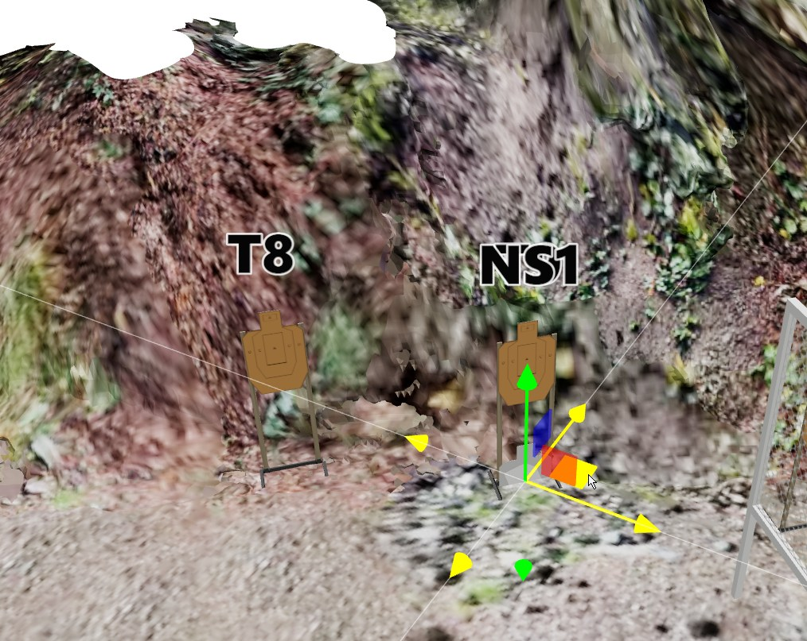
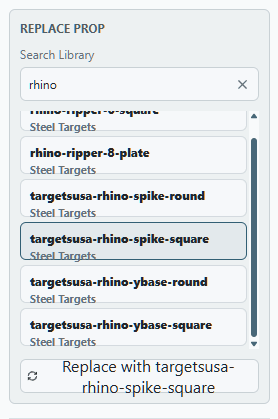
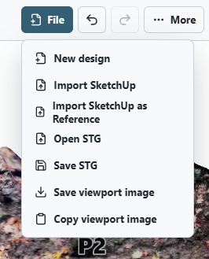
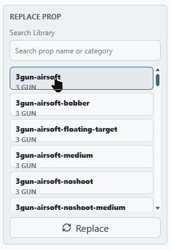
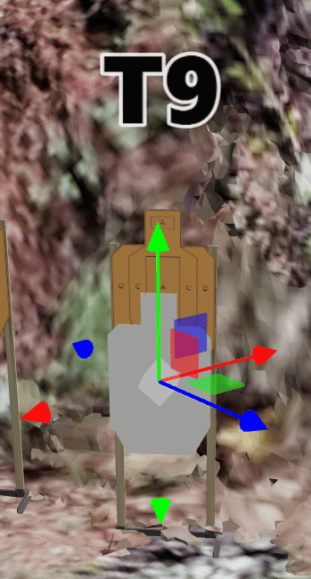
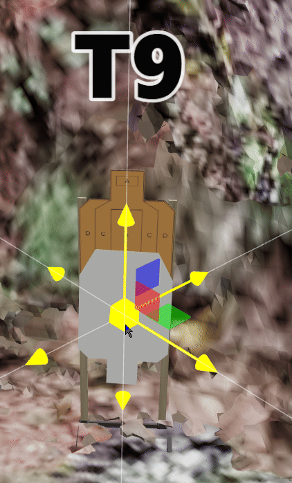

# Practism Designer Web — Feedback Log

**Tester:** _(your name)_
**App version / build:** _(fill in)_
**Browser / OS:** _(e.g. Chrome 128 / Windows 11)_
**Test period:** 2026-08-17 → _(ongoing)_

Media lives in [`feedback-media/`](./feedback-media/). Name files `NN-short-slug.png|gif` matching the item ID (e.g. `001-drag-snap.gif`).

---

## Summary

| ID | Title | Type | Severity | Status |
|----|-------|------|----------|--------|
| 001 | No-shoot can't be attached to an existing target — spawns on the ground | UX | High | Open |
| 002 | No-shoot rotation gizmo axes not aligned to XYZ — hard to flip upside-down | Bug | High | Open |
| 003 | "Replace Prop" search box resets between replacements | UX | Low | Open |
| 004 | Add "Update stage in match" to the File menu when a stage is opened from Match view | Feature Request | Medium | Open |
| 005 | Replace Prop needs two steps (select + Replace); Replace button sometimes does nothing | UX | Medium | Open |
| 006 | Move gizmo: ground-plane (green) handle gets blocked by other plane handles; gizmo doesn't face the camera | UX | High | Open |
| 007 | No-shoot snaps too aggressively — can't fine-tune coverage; full coverage should never be allowed | UX | Medium | Open |
| 008 | Snapping resets a no-shoot's rotation | Bug | High | Open |
| 009 | Allow walls to be rotated by dragging one end, like fault lines | Feature Request | Medium | Open |
| 010 | Add a "Face me" button/hotkey to aim a prop at the current camera | Feature Request | Medium | Open |

**Type:** Bug · UX · Feature Request · Performance · Docs
**Severity:** Blocker · High · Medium · Low
**Status:** Open · Confirmed · Fixed · Won't Fix · Deferred

### Themes

**A. Transform gizmo fundamentals (#002, #006, #008, #010)** — the single highest-impact cluster. Rotation rings aren't axis-aligned, the translate gizmo's plane handles occlude each other because the gizmo doesn't face the camera, and snapping wipes user-set rotation. Together these make basic "put this prop where I want it, facing where I want" operations slow and frustrating. Fixing the gizmo (camera-facing handles, local/world XYZ alignment, angle snapping, translation-only snap) would resolve most of the reported friction; "Face me" (#010) then removes most remaining manual rotation.

**B. No-shoot workflow (#001, #007, #008)** — no-shoots spawn on the ground instead of attaching to a target, snapping is too coarse to dial in partial coverage, and snapping discards rotation. Real-world no-shoots are almost always mounted relative to an existing target with a specific partial overlap, so this is a core stage-design workflow that currently fights the user.

**C. Replace Prop panel (#003, #005)** — both small, both hit the same bulk-swap loop: the search term clears between replacements and the flow requires an extra Replace click that occasionally no-ops. Cheap wins.

**D. Match integration (#004)** — a stage opened from Match view can't be written back to the match, forcing a save-STG-and-reattach round trip across every stage before a match.

**E. Wall manipulation (#009)** — endpoint-drag rotation (fault-line style) matches how layouts are actually built: anchor one end, swing the other.

### Suggested priority

1. #006, #002, #008 — gizmo/snapping correctness (blocks everyday editing)
2. #001, #007 — no-shoot placement workflow
3. #010, #009 — high-leverage placement shortcuts
4. #004 — match round-trip
5. #005, #003 — Replace Prop polish

---

## 001 — No-shoot can't be attached to an existing target — spawns on the ground

- **Type:** UX
- **Severity:** High
- **Status:** Open
- **Area:** 3D Canvas / Target placement
- **Date:** 2026-08-17

**Steps to reproduce**
1. Place a shoot target (e.g. T8 / NS1 stand) in the bay.
2. Add a no-shoot target from the props/target palette.
3. Observe where the new no-shoot is placed.

**Expected**
The no-shoot should snap/attach to the selected existing target — mounted at the same height and plane, with an option to offset left/right/overlap (the common real-world setup of a hardcover/no-shoot stapled or clamped next to an existing target on the same stand).

**Actual**
The no-shoot spawns flat on the ground at the origin of the stand and has to be manually raised, rotated, and aligned with the gizmo. Getting it flush with the existing target is fiddly and hard to do accurately.

**Suggested fix**
- Snap-to-target: dragging a no-shoot near an existing target highlights an attach point and snaps it to the same height/rotation.
- Or a right-click / context action on a target: "Add no-shoot → left / right / behind / overlapping".
- Default new no-shoots to standard target height instead of ground level.

**Media**

**Notes**
Screenshot shows the gizmo on a no-shoot sitting at ground level next to NS1's stand.

---

## 002 — No-shoot rotation gizmo axes not aligned to XYZ — hard to flip upside-down

- **Type:** Bug
- **Severity:** High
- **Status:** Open
- **Area:** 3D Canvas / Transform gizmo
- **Date:** 2026-08-17

**Steps to reproduce**
1. Select a no-shoot target in the bay.
2. Switch to the rotate gizmo.
3. Try to rotate it 180° to make it upside-down.

**Expected**
The rotation rings should align with the world (or the object's own) X/Y/Z axes, so a single ring drag produces a clean 180° flip about a predictable axis.

**Actual**
The rotation axes are skewed / not aligned with XYZ, so dragging a ring rotates the target about an off-axis direction. Getting a clean upside-down orientation requires repeated trial-and-error adjustments across multiple rings.

**Suggested fix**
- Fix the gizmo so rotation rings map to the object's local XYZ (with a world/local toggle).
- Add snap-to-angle increments (15° / 45° / 90°) while dragging.
- Add a one-click "Flip upside-down" (180°) button in the target's context menu or properties panel — this is a common no-shoot/hardcover configuration.

**Media**

**Notes**

---

## 003 — "Replace Prop" search box resets between replacements

- **Type:** UX
- **Severity:** Low
- **Status:** Open
- **Area:** Replace Prop panel / Search Library
- **Date:** 2026-08-17

**Steps to reproduce**
1. Select a prop and open **Replace Prop**.
2. Type a query in **Search Library** (e.g. `rhino`) and pick a replacement.
3. Select the next prop and open **Replace Prop** again.

**Expected**
The search term (and ideally the scroll position / last-picked item) persists, so replacing several props with the same library item is a couple of clicks each.

**Actual**
The search box is cleared each time, so the same query has to be retyped for every prop being replaced. Minor but repetitive when swapping many props at once.

**Suggested fix**
- Persist the last search term for the session, or
- Support multi-select → replace all selected props with one pick, or
- Add a "recent replacements" shortcut row.

**Media**

**Notes**

---

## 004 — Add "Update stage in match" to the File menu when a stage is opened from Match view

- **Type:** Feature Request
- **Severity:** Medium
- **Status:** Open
- **Area:** File menu / Match integration
- **Date:** 2026-08-17

**Context**
When a stage is opened for editing from the **Match** view, the editor knows which match and which stage slot it came from, but the File menu only offers generic file operations (New design, Import SketchUp, Open STG, Save STG, Save/Copy viewport image).

**Request**
Add a **"Update stage in match"** item to the File menu, enabled only when the current design was opened from a match. It should write the edited stage straight back into the originating match/stage slot — no export-then-reimport round trip.

**Why**
Editing a match's stages currently means saving an STG locally and re-uploading/reattaching it to the match, which is slow and easy to get wrong (wrong bay, stale version) when iterating over 7+ stages before a match.

**Nice-to-haves**
- Show the source match/stage name somewhere in the header so it's obvious the design is match-linked.
- Grey out or hide the item when the design isn't match-linked.
- Confirmation toast with a link back to the match.

**Media**

**Notes**
Screenshot shows the current File menu contents.

---

## 005 — Replace Prop needs two steps (select + Replace); Replace button sometimes does nothing

- **Type:** UX
- **Severity:** Medium
- **Status:** Open
- **Area:** Replace Prop panel
- **Date:** 2026-08-17

**Steps to reproduce**
1. Select a prop in the scene and open **Replace Prop**.
2. Click a prop in the Search Library list to highlight it.
3. Click the **Replace** button at the bottom of the panel.

**Expected**
Clicking the desired prop in the list should commit the replacement immediately — one click, no confirm step.

**Actual**
Replacement is a two-step select-then-Replace flow. Worse, the **Replace** button sometimes does nothing (see GIF), so it's unclear whether the selection registered or the replacement failed.

**Suggested fix**
- Make a single click on a library entry perform the replacement immediately.
- If a confirm step must stay, label the button with the selected prop name and disable it when nothing is selected, so a dead click is impossible.
- Investigate why Replace is a no-op in the recorded case — likely the list selection isn't propagating to the button's handler.

Related: #003 (search box resets between replacements). Fixing both together would make bulk prop swapping much faster.

**Media**

**Notes**

---

## 006 — Move gizmo: ground-plane (green) handle gets blocked by other plane handles; gizmo doesn't face the camera

- **Type:** UX
- **Severity:** High
- **Status:** Open
- **Area:** 3D Canvas / Transform gizmo (translate)
- **Date:** 2026-08-17

**Steps to reproduce**
1. Select a wall (or any prop) in the bay.
2. Orbit the camera so you're viewing the prop from the opposite side.
3. Try to click and drag the green ground-plane square to move the prop along the 2D floor plane.

**Expected**
The plane handle you need should always be reachable — the gizmo should orient its handles/quadrants toward the current camera so the ground-plane square is never occluded by the other plane squares or axis arrows.

**Actual**
The gizmo handles appear to be fixed in orientation, so from certain camera angles the green ground-plane square is hidden behind or overlapped by the other plane handles and can't be clicked. Moving a prop then requires orbiting the camera back to a "good" angle first, which makes basic repositioning clunky.

**Suggested fix**
- Make the gizmo camera-facing: flip the plane quadrants/axis directions to the side nearest the camera (standard behavior in Blender/Unity/Three.js `TransformControls`).
- Depth-sort or prioritize handle picking so the ground-plane handle wins when handles overlap on screen.
- Alternative/complementary: allow dragging the prop body directly to move it along the ground plane, with modifier keys for the vertical axis.
- Add a way to lock movement to the ground plane (a mode toggle), which covers the majority of stage-design moves.

**Media**

**Notes**
GIF shows the situation when trying to move a wall while viewing it from the other side.
Related: #002 — the rotate gizmo has a comparable axis-orientation problem.

---

## 007 — No-shoot snaps too aggressively — can't fine-tune coverage; full coverage should never be allowed

- **Type:** UX
- **Severity:** Medium
- **Status:** Open
- **Area:** 3D Canvas / No-shoot placement & snapping
- **Date:** 2026-08-17

**Steps to reproduce**
1. Place a no-shoot in front of / overlapping a shoot target (e.g. T9).
2. Drag it slightly to adjust how much of the target it covers.

**Expected**
Fine, near-continuous control over coverage — a no-shoot typically hides part of a target (a shoulder, an edge, the upper A-zone) and the designer needs to dial in exactly how much is exposed.

**Actual**
Snapping is too strong: the no-shoot jumps between coarse positions relative to the target, so intermediate coverage amounts are hard or impossible to reach. Small adjustments get pulled back to a snap point.

**Additional**
Full coverage of a target by a no-shoot is never a valid stage-design scenario — a fully hidden target isn't shootable. The tool should prevent or at least warn on 100% coverage.

**Suggested fix**
- Reduce snap strength / snap radius for no-shoot-to-target positioning, or add a modifier key (e.g. hold `Alt`/`Ctrl`) to temporarily disable snapping for fine adjustment.
- Expose a coverage percentage readout while dragging, and/or a numeric offset field.
- Clamp so a no-shoot cannot fully occlude a target from the intended shooting position; flag it as a validation warning if it does.

**Media**

**Notes**
Related: #001 (no-shoot attach behavior) — both concern no-shoot placement relative to an existing target.

---

## 008 — Snapping resets a no-shoot's rotation

- **Type:** Bug
- **Severity:** High
- **Status:** Open
- **Area:** 3D Canvas / Snapping + transform state
- **Date:** 2026-08-17

**Steps to reproduce**
1. Place a no-shoot and rotate it to the desired orientation (e.g. flipped/angled relative to T9).
2. Drag the no-shoot so it snaps to a target or another prop.
3. Observe the no-shoot's rotation after the snap.

**Expected**
Snapping should only affect position. The user-set rotation must be preserved — snapping is a placement aid, not a transform reset.

**Actual**
The snap overwrites the rotation, so the no-shoot pops back to a default orientation and the rotation work has to be redone. This is especially painful given #002 (rotation is already hard to set).

**Suggested fix**
- Apply only the translation component when snapping; leave the rotation quaternion untouched.
- If rotation alignment is intentional in some cases, make it opt-in (e.g. a "match target orientation" action) rather than an implicit side effect of a drag.

**Media**

**Notes**
Compounds with #002 and #007 — rotation is hard to set, snapping is aggressive, and then the snap discards the rotation.

---

## 009 — Allow walls to be rotated by dragging one end, like fault lines

- **Type:** Feature Request
- **Severity:** Medium
- **Status:** Open
- **Area:** 3D Canvas / Wall manipulation
- **Date:** 2026-08-17

**Context**
Fault lines can be shaped by grabbing an endpoint and dragging it. Walls only offer the center transform gizmo, so changing a wall's angle means rotating about its center and then re-positioning it — which breaks any snap it already had at one end.

**Request**
Give walls endpoint handles: dragging one end pivots the wall about the opposite end, the same interaction model as fault lines.

**Why**
Stage layouts are usually built by anchoring one end of a wall to an existing prop (another wall, a corner, a bay edge) and then swinging the free end to set the angle. With center-based rotation, the anchored end drifts and has to be re-snapped after every angle change.

**Nice-to-haves**
- When the opposite end is snapped to another prop, treat that snap as the pivot automatically.
- Angle snapping (15°/45°/90°) while swinging the free end.
- Live length/angle readout during the drag.
- Optionally allow endpoint drag to also change wall length (drag = rotate + extend), with a modifier to constrain to rotation only.

**Media**

_(no media)_

**Notes**
Related: #006 — a wall-specific interaction like this would sidestep much of the move-gizmo occlusion problem.

---

## 010 — Add a "Face me" button/hotkey to aim a prop at the current camera

- **Type:** Feature Request
- **Severity:** Medium
- **Status:** Open
- **Area:** 3D Canvas / Prop orientation
- **Date:** 2026-08-17

**Request**
Add a **"Face me"** action — a toolbar/context-menu button plus a keyboard shortcut — that rotates the selected prop so its front faces the current camera position.

**Why**
When placing targets, the designer usually moves the camera to the shooting position they're designing for and then wants the target squared up to that view. Today that means manually rotating with the gizmo and eyeballing it, which is slow and imprecise — especially given the rotation-axis issues in #002.

**Details / nice-to-haves**
- Yaw-only by default (keep the target upright); a modifier or option for full aim including pitch.
- Work on multi-selection so a whole array of targets can be squared to one shooting position at once.
- Complementary "Face shooter position" variant that aims at a designated shooting box / start position rather than the free camera — arguably the more correct reference for stage design.
- Optional angle snapping after the operation.

**Media**

_(no media)_

**Notes**
Related: #002 — this would remove most of the need to hand-rotate targets.

---

<!--
COPY THIS BLOCK FOR EACH NEW ITEM

## NNN — title

- **Type:**
- **Severity:**
- **Status:** Open
- **Area:**
- **Date:**

**Steps to reproduce**
1.

**Expected**

**Actual**

**Media**

**Notes**

---
-->
